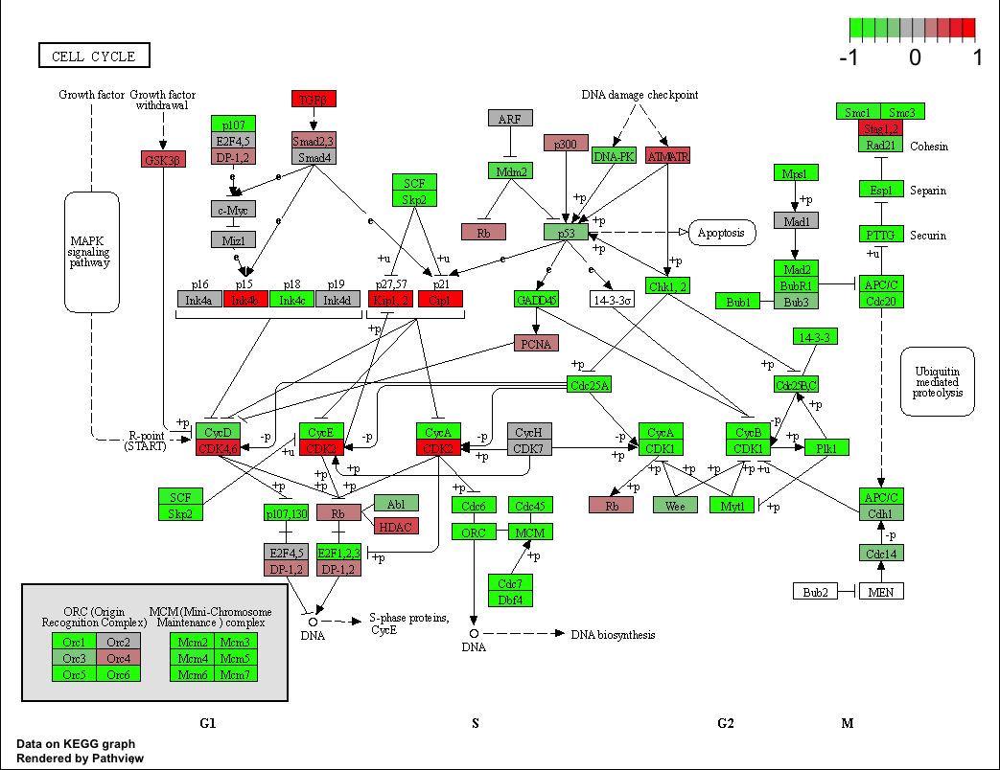

Class 13: RNASeq Mini Project
================
Benjamin lee

The data for for hands-on session comes from GEO entry: GSE37704, which
is associated with the following publication:

Trapnell C, Hendrickson DG, Sauvageau M, Goff L et al. “Differential
analysis of gene regulation at transcript resolution with RNA-seq”. Nat
Biotechnol 2013 Jan;31(1):46-53. PMID: 23222703

## RNASeq input data

Again I need two things

-countData -colData

``` r
colData <- read.csv("GSE37704_metadata.csv", row.names=1)
head(colData)
```

                  condition
    SRR493366 control_sirna
    SRR493367 control_sirna
    SRR493368 control_sirna
    SRR493369      hoxa1_kd
    SRR493370      hoxa1_kd
    SRR493371      hoxa1_kd

``` r
countData <- read.csv("GSE37704_featurecounts.csv", row.names=1)
head(countData)
```

                    length SRR493366 SRR493367 SRR493368 SRR493369 SRR493370
    ENSG00000186092    918         0         0         0         0         0
    ENSG00000279928    718         0         0         0         0         0
    ENSG00000279457   1982        23        28        29        29        28
    ENSG00000278566    939         0         0         0         0         0
    ENSG00000273547    939         0         0         0         0         0
    ENSG00000187634   3214       124       123       205       207       212
                    SRR493371
    ENSG00000186092         0
    ENSG00000279928         0
    ENSG00000279457        46
    ENSG00000278566         0
    ENSG00000273547         0
    ENSG00000187634       258

There is an unwanted first column “length” in the countData. I will need
to remove this first before going on to further analysis.

``` r
counts <- countData[,-1]
head(counts)
```

                    SRR493366 SRR493367 SRR493368 SRR493369 SRR493370 SRR493371
    ENSG00000186092         0         0         0         0         0         0
    ENSG00000279928         0         0         0         0         0         0
    ENSG00000279457        23        28        29        29        28        46
    ENSG00000278566         0         0         0         0         0         0
    ENSG00000273547         0         0         0         0         0         0
    ENSG00000187634       124       123       205       207       212       258

``` r
all(colnames(counts) == rownames(colData))
```

    [1] TRUE

## Remove zero count genes

There are lots of genes here with no count data - i.e. zero counts in
all experiments. Let’s remove these before running DESeq

``` r
head(counts)
```

                    SRR493366 SRR493367 SRR493368 SRR493369 SRR493370 SRR493371
    ENSG00000186092         0         0         0         0         0         0
    ENSG00000279928         0         0         0         0         0         0
    ENSG00000279457        23        28        29        29        28        46
    ENSG00000278566         0         0         0         0         0         0
    ENSG00000273547         0         0         0         0         0         0
    ENSG00000187634       124       123       205       207       212       258

``` r
to.keep <- rowSums(counts) > 0
counts <- counts[to.keep,]
head(counts)
```

                    SRR493366 SRR493367 SRR493368 SRR493369 SRR493370 SRR493371
    ENSG00000279457        23        28        29        29        28        46
    ENSG00000187634       124       123       205       207       212       258
    ENSG00000188976      1637      1831      2383      1226      1326      1504
    ENSG00000187961       120       153       180       236       255       357
    ENSG00000187583        24        48        65        44        48        64
    ENSG00000187642         4         9        16        14        16        16

How many genes do we have left?

``` r
nrow(counts)
```

    [1] 15975

Time to use DESeq

``` r
library(DESeq2)
```

    Loading required package: S4Vectors

    Loading required package: stats4

    Loading required package: BiocGenerics


    Attaching package: 'BiocGenerics'

    The following objects are masked from 'package:stats':

        IQR, mad, sd, var, xtabs

    The following objects are masked from 'package:base':

        anyDuplicated, append, as.data.frame, basename, cbind, colnames,
        dirname, do.call, duplicated, eval, evalq, Filter, Find, get, grep,
        grepl, intersect, is.unsorted, lapply, Map, mapply, match, mget,
        order, paste, pmax, pmax.int, pmin, pmin.int, Position, rank,
        rbind, Reduce, rownames, sapply, setdiff, sort, table, tapply,
        union, unique, unsplit, which.max, which.min


    Attaching package: 'S4Vectors'

    The following objects are masked from 'package:base':

        expand.grid, I, unname

    Loading required package: IRanges

    Loading required package: GenomicRanges

    Loading required package: GenomeInfoDb

    Loading required package: SummarizedExperiment

    Loading required package: MatrixGenerics

    Loading required package: matrixStats


    Attaching package: 'MatrixGenerics'

    The following objects are masked from 'package:matrixStats':

        colAlls, colAnyNAs, colAnys, colAvgsPerRowSet, colCollapse,
        colCounts, colCummaxs, colCummins, colCumprods, colCumsums,
        colDiffs, colIQRDiffs, colIQRs, colLogSumExps, colMadDiffs,
        colMads, colMaxs, colMeans2, colMedians, colMins, colOrderStats,
        colProds, colQuantiles, colRanges, colRanks, colSdDiffs, colSds,
        colSums2, colTabulates, colVarDiffs, colVars, colWeightedMads,
        colWeightedMeans, colWeightedMedians, colWeightedSds,
        colWeightedVars, rowAlls, rowAnyNAs, rowAnys, rowAvgsPerColSet,
        rowCollapse, rowCounts, rowCummaxs, rowCummins, rowCumprods,
        rowCumsums, rowDiffs, rowIQRDiffs, rowIQRs, rowLogSumExps,
        rowMadDiffs, rowMads, rowMaxs, rowMeans2, rowMedians, rowMins,
        rowOrderStats, rowProds, rowQuantiles, rowRanges, rowRanks,
        rowSdDiffs, rowSds, rowSums2, rowTabulates, rowVarDiffs, rowVars,
        rowWeightedMads, rowWeightedMeans, rowWeightedMedians,
        rowWeightedSds, rowWeightedVars

    Loading required package: Biobase

    Welcome to Bioconductor

        Vignettes contain introductory material; view with
        'browseVignettes()'. To cite Bioconductor, see
        'citation("Biobase")', and for packages 'citation("pkgname")'.


    Attaching package: 'Biobase'

    The following object is masked from 'package:MatrixGenerics':

        rowMedians

    The following objects are masked from 'package:matrixStats':

        anyMissing, rowMedians

1st step: Setup the object required by DESeq

``` r
dds <- DESeqDataSetFromMatrix(countData = counts,
                       colData = colData,
                       design = ~condition)
```

    Warning in DESeqDataSet(se, design = design, ignoreRank): some variables in
    design formula are characters, converting to factors

Run the analysis

``` r
dds <- DESeq(dds)
```

    estimating size factors

    estimating dispersions

    gene-wise dispersion estimates

    mean-dispersion relationship

    final dispersion estimates

    fitting model and testing

``` r
res <- results(dds)
```

``` r
head(res)
```

    log2 fold change (MLE): condition hoxa1 kd vs control sirna 
    Wald test p-value: condition hoxa1 kd vs control sirna 
    DataFrame with 6 rows and 6 columns
                     baseMean log2FoldChange     lfcSE       stat      pvalue
                    <numeric>      <numeric> <numeric>  <numeric>   <numeric>
    ENSG00000279457   29.9136      0.1792571 0.3248216   0.551863 5.81042e-01
    ENSG00000187634  183.2296      0.4264571 0.1402658   3.040350 2.36304e-03
    ENSG00000188976 1651.1881     -0.6927205 0.0548465 -12.630158 1.43990e-36
    ENSG00000187961  209.6379      0.7297556 0.1318599   5.534326 3.12428e-08
    ENSG00000187583   47.2551      0.0405765 0.2718928   0.149237 8.81366e-01
    ENSG00000187642   11.9798      0.5428105 0.5215598   1.040744 2.97994e-01
                           padj
                      <numeric>
    ENSG00000279457 6.86555e-01
    ENSG00000187634 5.15718e-03
    ENSG00000188976 1.76549e-35
    ENSG00000187961 1.13413e-07
    ENSG00000187583 9.19031e-01
    ENSG00000187642 4.03379e-01

# Volcano plot

``` r
plot(res$log2FoldChange, log(res$padj))
```


I want to add some color. Take a fold-change threshold of -2/+2 and an
alpha p-adj (p-value) threshold of 0.05

``` r
mycols <- rep("gray", nrow(counts))
mycols[ abs(res$log2FoldChange) > 2 ] <- "blue"
mycols[ res$padj > 0.05 ] <- "red"

plot( res$log2FoldChange, -log(res$padj), col=mycols)
abline(v=c(-2,+2))
abline(h=-log(0.05))
```


# Adding gene annotation

I am going to add the database identiifiers I need for pathway analysis
here

``` r
library("AnnotationDbi")
library("org.Hs.eg.db")
```

``` r
columns(org.Hs.eg.db)
```

     [1] "ACCNUM"       "ALIAS"        "ENSEMBL"      "ENSEMBLPROT"  "ENSEMBLTRANS"
     [6] "ENTREZID"     "ENZYME"       "EVIDENCE"     "EVIDENCEALL"  "GENENAME"    
    [11] "GENETYPE"     "GO"           "GOALL"        "IPI"          "MAP"         
    [16] "OMIM"         "ONTOLOGY"     "ONTOLOGYALL"  "PATH"         "PFAM"        
    [21] "PMID"         "PROSITE"      "REFSEQ"       "SYMBOL"       "UCSCKG"      
    [26] "UNIPROT"     

``` r
res$symbol = mapIds(org.Hs.eg.db,
                    keys=rownames(res), 
                    keytype="ENSEMBL",
                    column="SYMBOL",
                    multiVals="first")
```

    'select()' returned 1:many mapping between keys and columns

``` r
res$entrez = mapIds(org.Hs.eg.db,
                    keys=rownames(res),
                    keytype="ENSEMBL",
                    column="ENTREZID",
                    multiVals="first")
```

    'select()' returned 1:many mapping between keys and columns

``` r
head(res)
```

    log2 fold change (MLE): condition hoxa1 kd vs control sirna 
    Wald test p-value: condition hoxa1 kd vs control sirna 
    DataFrame with 6 rows and 8 columns
                     baseMean log2FoldChange     lfcSE       stat      pvalue
                    <numeric>      <numeric> <numeric>  <numeric>   <numeric>
    ENSG00000279457   29.9136      0.1792571 0.3248216   0.551863 5.81042e-01
    ENSG00000187634  183.2296      0.4264571 0.1402658   3.040350 2.36304e-03
    ENSG00000188976 1651.1881     -0.6927205 0.0548465 -12.630158 1.43990e-36
    ENSG00000187961  209.6379      0.7297556 0.1318599   5.534326 3.12428e-08
    ENSG00000187583   47.2551      0.0405765 0.2718928   0.149237 8.81366e-01
    ENSG00000187642   11.9798      0.5428105 0.5215598   1.040744 2.97994e-01
                           padj      symbol      entrez
                      <numeric> <character> <character>
    ENSG00000279457 6.86555e-01          NA          NA
    ENSG00000187634 5.15718e-03      SAMD11      148398
    ENSG00000188976 1.76549e-35       NOC2L       26155
    ENSG00000187961 1.13413e-07      KLHL17      339451
    ENSG00000187583 9.19031e-01     PLEKHN1       84069
    ENSG00000187642 4.03379e-01       PERM1       84808

Save my results so far to a CSV file

``` r
res = res[order(res$pvalue),]
write.csv(res, file="deseq_results.csv")
```

## Pathway Analysis

Again we will use the ‘gage()’ package and function with a focus first
on KEGG and GO.

``` r
library(gage)
```

``` r
library(gageData)

data(kegg.sets.hs)
data(sigmet.idx.hs)

# Focus on signaling and metabolic pathways only
kegg.sets.hs = kegg.sets.hs[sigmet.idx.hs]
```

Recall that ‘gage()’ function wants only a vector of importance as the
input that has names in ENTREZID format.

``` r
foldchanges = res$log2FoldChange
names(foldchanges) = res$entrez
head(foldchanges)
```

         1266     54855      1465     51232      2034      2317 
    -2.422719  3.201955 -2.313738 -2.059631 -1.888019 -1.649792 

``` r
# Get the results
keggres = gage(foldchanges, gsets=kegg.sets.hs)
```

``` r
head(keggres$less, 5)
```

                                         p.geomean stat.mean        p.val
    hsa04110 Cell cycle               8.995727e-06 -4.378644 8.995727e-06
    hsa03030 DNA replication          9.424076e-05 -3.951803 9.424076e-05
    hsa03013 RNA transport            1.375901e-03 -3.028500 1.375901e-03
    hsa03440 Homologous recombination 3.066756e-03 -2.852899 3.066756e-03
    hsa04114 Oocyte meiosis           3.784520e-03 -2.698128 3.784520e-03
                                            q.val set.size         exp1
    hsa04110 Cell cycle               0.001448312      121 8.995727e-06
    hsa03030 DNA replication          0.007586381       36 9.424076e-05
    hsa03013 RNA transport            0.073840037      144 1.375901e-03
    hsa03440 Homologous recombination 0.121861535       28 3.066756e-03
    hsa04114 Oocyte meiosis           0.121861535      102 3.784520e-03

Generate a colored pathway figure for hsa04110 Cell cycle

``` r
library(pathview)
```

    ##############################################################################
    Pathview is an open source software package distributed under GNU General
    Public License version 3 (GPLv3). Details of GPLv3 is available at
    http://www.gnu.org/licenses/gpl-3.0.html. Particullary, users are required to
    formally cite the original Pathview paper (not just mention it) in publications
    or products. For details, do citation("pathview") within R.

    The pathview downloads and uses KEGG data. Non-academic uses may require a KEGG
    license agreement (details at http://www.kegg.jp/kegg/legal.html).
    ##############################################################################

``` r
pathview(gene.data=foldchanges, pathway.id="hsa04110")
```

    'select()' returned 1:1 mapping between keys and columns

    Info: Working in directory /Users/benlee509/BIMM 143/bimm143_github/class13

    Info: Writing image file hsa04110.pathview.png



## Overall Steps

Read colData & countData -check data -filter zero count genes

Run DESeq -Plot focus on abs (fold-change) and padj (p-value)

Annotation

Pathway Analysis - KEGG, GO, etc.

## Gene Ontology (GO)

We can also do a similar procedure with gene ontology. Similar to above,
go.sets.hs has all GO terms. go.subs.hs is a named list containing
indexes for the BP, CC, and MF ontologies. Let’s focus on BP (a.k.a
Biological Process) here.

``` r
data(go.sets.hs)
data(go.subs.hs)

# Focus on Biological Process subset of GO
gobpsets = go.sets.hs[go.subs.hs$BP]

gobpres = gage(foldchanges, gsets=gobpsets, same.dir=TRUE)

lapply(gobpres, head)
```

    $greater
                                                 p.geomean stat.mean        p.val
    GO:0007156 homophilic cell adhesion       8.519724e-05  3.824205 8.519724e-05
    GO:0002009 morphogenesis of an epithelium 1.396681e-04  3.653886 1.396681e-04
    GO:0048729 tissue morphogenesis           1.432451e-04  3.643242 1.432451e-04
    GO:0007610 behavior                       2.195494e-04  3.530241 2.195494e-04
    GO:0060562 epithelial tube morphogenesis  5.932837e-04  3.261376 5.932837e-04
    GO:0035295 tube development               5.953254e-04  3.253665 5.953254e-04
                                                  q.val set.size         exp1
    GO:0007156 homophilic cell adhesion       0.1951953      113 8.519724e-05
    GO:0002009 morphogenesis of an epithelium 0.1951953      339 1.396681e-04
    GO:0048729 tissue morphogenesis           0.1951953      424 1.432451e-04
    GO:0007610 behavior                       0.2243795      427 2.195494e-04
    GO:0060562 epithelial tube morphogenesis  0.3711390      257 5.932837e-04
    GO:0035295 tube development               0.3711390      391 5.953254e-04

    $less
                                                p.geomean stat.mean        p.val
    GO:0048285 organelle fission             1.536227e-15 -8.063910 1.536227e-15
    GO:0000280 nuclear division              4.286961e-15 -7.939217 4.286961e-15
    GO:0007067 mitosis                       4.286961e-15 -7.939217 4.286961e-15
    GO:0000087 M phase of mitotic cell cycle 1.169934e-14 -7.797496 1.169934e-14
    GO:0007059 chromosome segregation        2.028624e-11 -6.878340 2.028624e-11
    GO:0000236 mitotic prometaphase          1.729553e-10 -6.695966 1.729553e-10
                                                    q.val set.size         exp1
    GO:0048285 organelle fission             5.841698e-12      376 1.536227e-15
    GO:0000280 nuclear division              5.841698e-12      352 4.286961e-15
    GO:0007067 mitosis                       5.841698e-12      352 4.286961e-15
    GO:0000087 M phase of mitotic cell cycle 1.195672e-11      362 1.169934e-14
    GO:0007059 chromosome segregation        1.658603e-08      142 2.028624e-11
    GO:0000236 mitotic prometaphase          1.178402e-07       84 1.729553e-10

    $stats
                                              stat.mean     exp1
    GO:0007156 homophilic cell adhesion        3.824205 3.824205
    GO:0002009 morphogenesis of an epithelium  3.653886 3.653886
    GO:0048729 tissue morphogenesis            3.643242 3.643242
    GO:0007610 behavior                        3.530241 3.530241
    GO:0060562 epithelial tube morphogenesis   3.261376 3.261376
    GO:0035295 tube development                3.253665 3.253665

## Reactome Analysis

Reactome is database consisting of biological molecules and their
relation to pathways and processes.

``` r
sig_genes <- res[res$padj <= 0.05 & !is.na(res$padj), "symbol"]
print(paste("Total number of significant genes:", length(sig_genes)))
```

    [1] "Total number of significant genes: 8147"

``` r
write.table(sig_genes, file="significant_genes.txt", row.names=FALSE, col.names=FALSE, quote=FALSE)
```

> Q: What pathway has the most significant “Entities p-value”? Do the
> most significant pathways listed match your previous KEGG results?
> What factors could cause differences between the two methods?

``` r
# most significant pathway with regards to entities p-value
min(sig_genes, na.rm = TRUE)
```

    [1] "A2M"

``` r
# we can see that most significant pathways dont match KEGG results
all(sig_genes == gobpres)
```

    Warning in sig_genes == gobpres: longer object length is not a multiple of
    shorter object length

    [1] FALSE

## GO Optional

``` r
sessionInfo()
```

    R version 4.2.1 (2022-06-23)
    Platform: x86_64-apple-darwin17.0 (64-bit)
    Running under: macOS Catalina 10.15.7

    Matrix products: default
    BLAS:   /Library/Frameworks/R.framework/Versions/4.2/Resources/lib/libRblas.0.dylib
    LAPACK: /Library/Frameworks/R.framework/Versions/4.2/Resources/lib/libRlapack.dylib

    locale:
    [1] en_US.UTF-8/en_US.UTF-8/en_US.UTF-8/C/en_US.UTF-8/en_US.UTF-8

    attached base packages:
    [1] stats4    stats     graphics  grDevices utils     datasets  methods  
    [8] base     

    other attached packages:
     [1] pathview_1.36.1             gageData_2.34.0            
     [3] gage_2.46.1                 org.Hs.eg.db_3.15.0        
     [5] AnnotationDbi_1.58.0        DESeq2_1.36.0              
     [7] SummarizedExperiment_1.26.1 Biobase_2.56.0             
     [9] MatrixGenerics_1.8.1        matrixStats_0.62.0         
    [11] GenomicRanges_1.48.0        GenomeInfoDb_1.32.4        
    [13] IRanges_2.30.1              S4Vectors_0.34.0           
    [15] BiocGenerics_0.42.0        

    loaded via a namespace (and not attached):
     [1] httr_1.4.4             bit64_4.0.5            jsonlite_1.8.3        
     [4] splines_4.2.1          blob_1.2.3             GenomeInfoDbData_1.2.8
     [7] yaml_2.3.6             pillar_1.8.1           RSQLite_2.2.18        
    [10] lattice_0.20-45        glue_1.6.2             digest_0.6.30         
    [13] RColorBrewer_1.1-3     XVector_0.36.0         colorspace_2.0-3      
    [16] htmltools_0.5.3        Matrix_1.5-1           XML_3.99-0.12         
    [19] pkgconfig_2.0.3        genefilter_1.78.0      zlibbioc_1.42.0       
    [22] GO.db_3.15.0           xtable_1.8-4           scales_1.2.1          
    [25] BiocParallel_1.30.4    tibble_3.1.8           annotate_1.74.0       
    [28] KEGGREST_1.36.3        generics_0.1.3         ggplot2_3.3.6         
    [31] cachem_1.0.6           cli_3.4.1              survival_3.4-0        
    [34] magrittr_2.0.3         crayon_1.5.2           KEGGgraph_1.56.0      
    [37] memoise_2.0.1          evaluate_0.17          fansi_1.0.3           
    [40] graph_1.74.0           tools_4.2.1            lifecycle_1.0.3       
    [43] stringr_1.4.1          munsell_0.5.0          locfit_1.5-9.6        
    [46] DelayedArray_0.22.0    Biostrings_2.64.1      compiler_4.2.1        
    [49] rlang_1.0.6            grid_4.2.1             RCurl_1.98-1.9        
    [52] rstudioapi_0.14        bitops_1.0-7           rmarkdown_2.17        
    [55] gtable_0.3.1           codetools_0.2-18       DBI_1.1.3             
    [58] R6_2.5.1               knitr_1.40             dplyr_1.0.10          
    [61] fastmap_1.1.0          bit_4.0.4              utf8_1.2.2            
    [64] Rgraphviz_2.40.0       stringi_1.7.8          parallel_4.2.1        
    [67] Rcpp_1.0.9             vctrs_0.5.0            geneplotter_1.74.0    
    [70] png_0.1-7              tidyselect_1.2.0       xfun_0.34             
